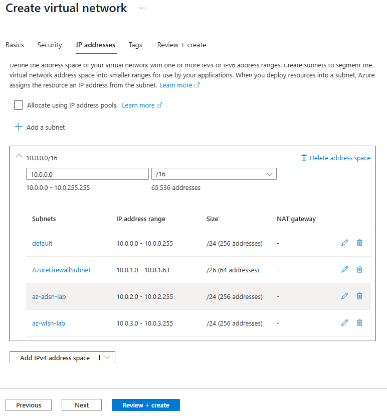
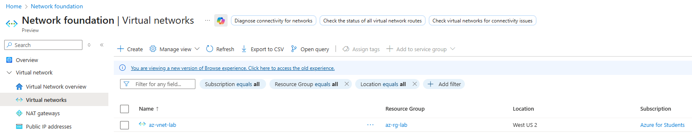

# Creating the Virtual Network

## Intent

Create a virtual network (VNet) to host all subnets required to manage, secure, and host the application server.

## SOP

1. In the **Azure portal**, search for **Virtual networks** and select **Create**.

2. Under **Project details**, choose your subscription and the previously created resource group.  
   - Subscription: e.g. **Azure for Students**  
   - Resource group: `az-rg-lab`

3. Under **Instance details**, enter:
   - **Virtual network name:** `az-vnet-lab`  
   - **Region:** `(US) West US 2` (or your chosen region)

   

4. Select the **IP addresses** tab.

5. Configure the address space for the VNet:
   - **IPv4 address space:** `10.0.0.0/16`

6. Add the required subnets (to match the architecture diagram):
   - `AzureFirewallSubnet` – `10.0.1.0/26`
   - `az-adsn-lab` – `10.0.2.0/24` (admin subnet)
   - `az-wlsn-lab` – `10.0.3.0/24` (workload/app subnet)

   

7. When the VNet and subnets are configured, select **Review + create**, wait for validation to complete, and then select **Create**.

8. After deployment finishes, return to the **Virtual networks** blade and confirm that `az-vnet-lab` appears with the expected address space and subnets.

   
