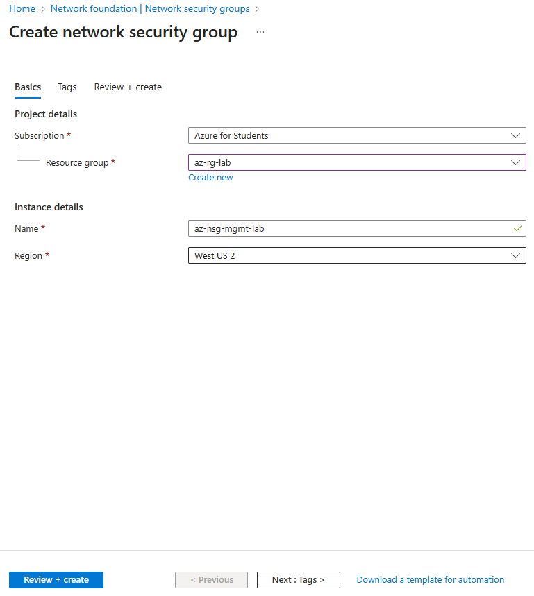
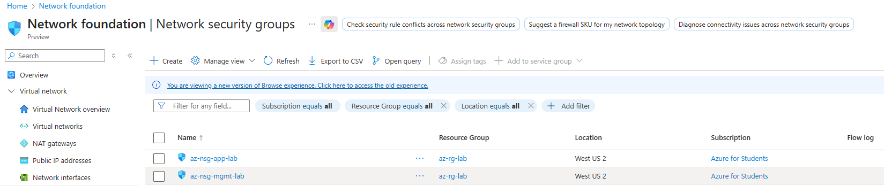
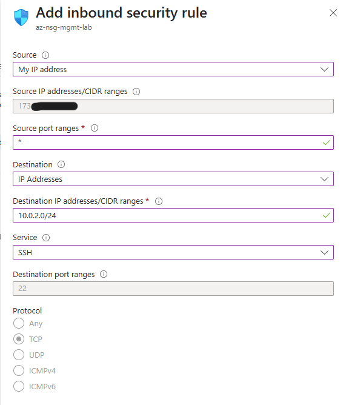
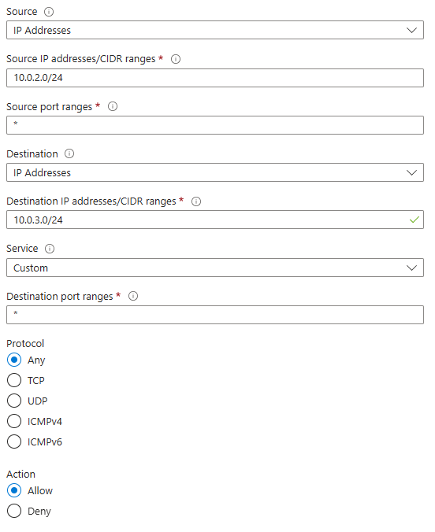
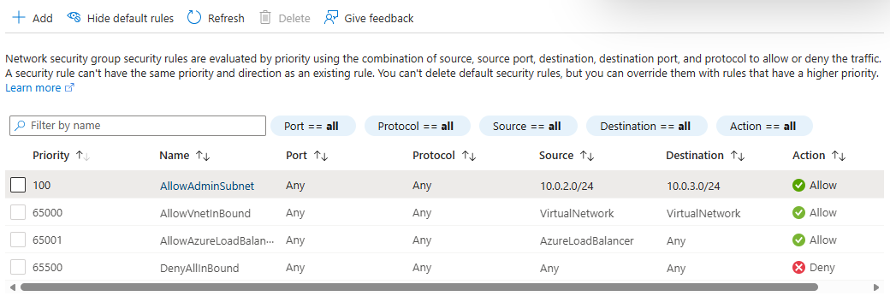
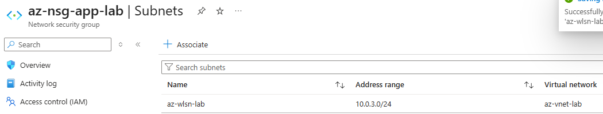

# Network Security Groups

## Creating the NSGs

### Intent

Using a layered security approach, create NSGs for the management and application subnets.

### SOP

1. In the **Azure portal**, navigate to **Network security groups** and select **Create**.
2. Choose the existing resource group `az-rg-lab`.
3. Enter a name for the NSG (for example, `az-nsg-mgmt-lab` or `az-nsg-app-lab`).
4. Select the same region as the VNet (e.g. `(US) West US 2`).
5. Click **Review + create**, then **Create**.

   

6. After deployment, return to the **Network security groups** blade and confirm that the NSGs are listed.  
   Repeat steps 1–5 until both NSGs exist (one for the admin subnet and one for the workload subnet).

   

---

## Configuring `az-adsn-lab` subnet NSG (management subnet)

### Intent

Allow SSH to the admin/jumpbox subnet (`az-adsn-lab`) **only** from a trusted public IP (your admin workstation).

### SOP

1. In the **Network security groups** blade, select **`az-nsg-mgmt-lab`**.
2. Under **Settings**, select **Inbound security rules**, then click **Add**.

3. Configure the rule:

   - **Source:** `My IP address` (or your specific admin public IP)
   - **Source port ranges:** `*`
   - **Destination:** `IP Addresses`
   - **Destination IP addresses/CIDR ranges:** `10.0.2.0/24` (management subnet)
   - **Service:** `SSH`
   - **Destination port ranges:** `22`
   - **Protocol:** `TCP`
   - **Action:** `Allow`
   - **Priority:** `100`  *(lower number = higher priority)*
   - **Name:** `AllowManagementSSH`
   - **Description:** `Allow SSH to management subnet from single source`

   

4. Click **Add** to save the rule.

5. Verify the rule appears at priority `100` above the default rules in the **Inbound security rules** list.

   

6. Associate the NSG with the management subnet:

   1. In the same NSG, go to **Subnets**.
   2. Click **Associate**.
   3. Choose the virtual network `az-vnet-lab` and subnet `az-adsn-lab`.
   4. Click **OK**.

   

---

## Configuring `az-wlsn-lab` subnet NSG (workload subnet)

### Intent

Allow inbound traffic to the workload subnet **only** from the management subnet. All other inbound traffic should be blocked by default.

### SOP

1. In the **Network security groups** blade, select **`az-nsg-app-lab`** (workload NSG).
2. Under **Settings**, select **Inbound security rules**, then click **Add**.

3. Configure the rule:

   - **Source:** `IP Addresses`
   - **Source IP addresses/CIDR ranges:** `10.0.2.0/24` (admin subnet)
   - **Source port ranges:** `*`
   - **Destination:** `IP Addresses`
   - **Destination IP addresses/CIDR ranges:** `10.0.3.0/24` (workload subnet)
   - **Service:** `Any` (or `SSH` if you want to restrict to SSH only)
   - **Destination port ranges:** `*` (or `22` for SSH only)
   - **Protocol:** `Any`
   - **Action:** `Allow`
   - **Priority:** `100`
   - **Name:** `AllowAdminSubnet`
   - **Description:** `Allow inbound from admin subnet az-adsn-lab`

   

4. Click **Add** to save the rule.

5. Verify the rule appears at priority `100` in the inbound rules.

   

6. Associate the NSG with the workload subnet:

   1. In the same NSG, go to **Subnets**.
   2. Click **Associate**.
   3. Choose virtual network `az-vnet-lab` and subnet `az-wlsn-lab`.
   4. Click **OK**.

   
