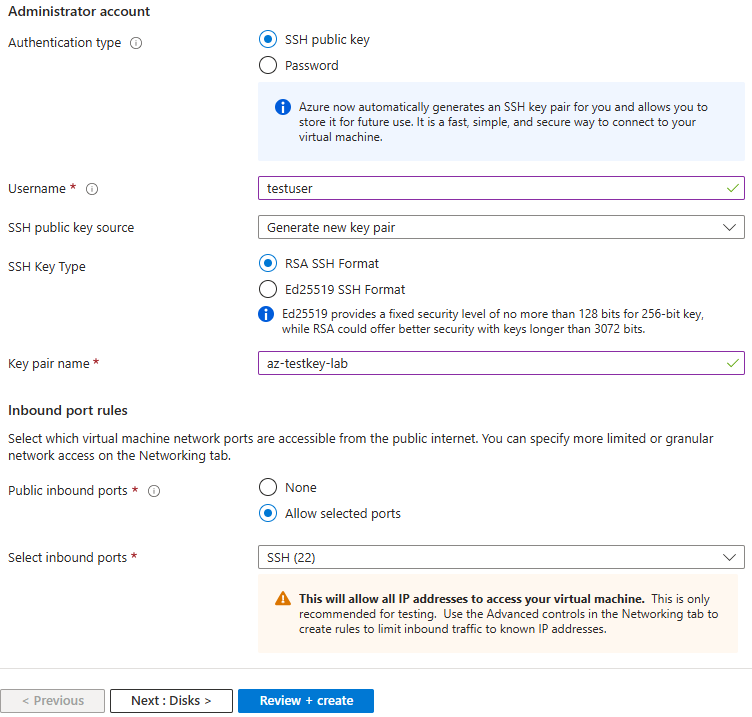
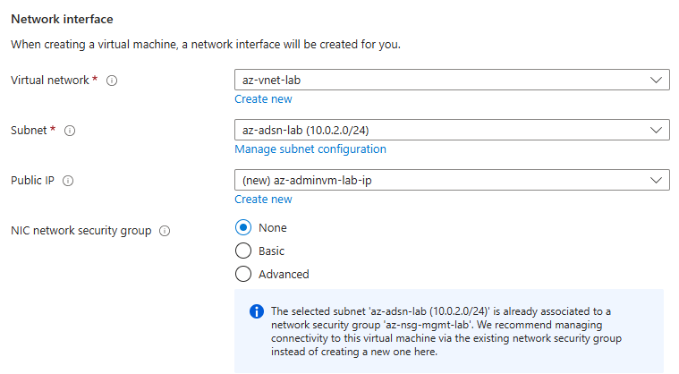
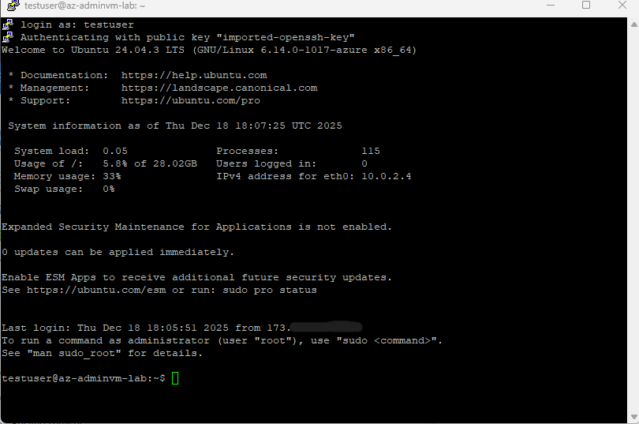
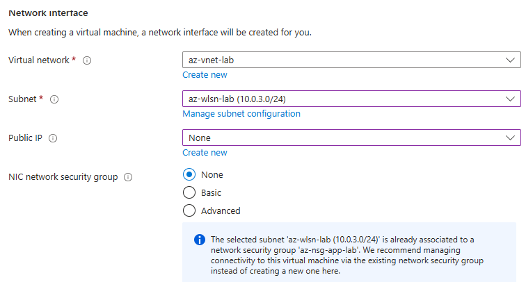
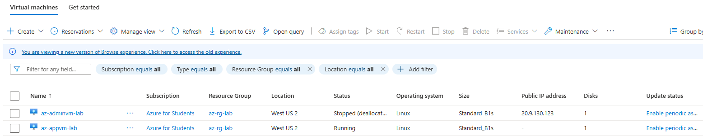

# Creating VMs for administrator subnet (`az-adsn-lab`) and pseudo server for workload subnet (`az-wlsn-lab`)

## Creating VM on admin subnet (`az-adsn-lab`)

### Intent

Use a VM on the admin subnet as a jump box to the workload subnet to perform administrative tasks on the application server.

### SOP

1. In the **Azure portal**, go to **Virtual machines** and click **Create** → **Azure virtual machine**.

2. On the **Basics** tab, follow the wizard to create the VM. For this lab, for example:
   - **Resource group:** `az-rg-lab`
   - **Virtual machine name:** `az-adminvm-lab`
   - **Region:** same as the VNet (e.g. `(US) West US 2`)
   - **Image:** Ubuntu LTS
   - **Authentication type:** **SSH public key**
   - **Username:** `testuser` (or similar)

   Near the bottom of the Basics tab, in the **Administrator account** section, choose **SSH public key** and create/name the key pair.

   

3. On the **Networking** tab:

   - **Virtual network:** `az-vnet-lab`
   - **Subnet:** `az-adsn-lab (10.0.2.0/24)`
   - **Public IP:** create a new public IP (e.g. `az-adminvm-lab-ip`) – this allows access to the jump box from the internet
   - **NIC network security group:** `None`  
     > The subnet is already protected by `az-nsg-mgmt-lab`, so we reuse that instead of creating a NIC NSG.

   

4. Click **Review + create**, wait for validation, then click **Create**.

5. Download and **save the private key file** when prompted. You’ll use this to SSH into the admin VM.

6. After deployment completes, go to the new VM’s **Overview** blade and note the **Public IP address**.

7. On your workstation, use **PuTTYgen** to convert the downloaded private key to PuTTY’s `.ppk` format (if you’re using PuTTY on Windows).

8. In **PuTTY**:

   - Under **Connection → SSH → Auth → Credentials**, browse to the `.ppk` file you created.
   - Back under **Session**, set the host to the admin VM’s public IP, and (optionally) save the session profile.

9. Open the session. When prompted, log in with the SSH username you configured (e.g. `testuser`).  
   You should see a shell prompt on `az-adminvm-lab`, showing its private IP on the management subnet (10.0.2.x).

   

---

## Creating pseudo application server in workload subnet (`az-wlsn-lab`)

### Intent

Create a VM that represents an internal application server hosted on the workload subnet, **without** direct internet exposure (no public IP).

### SOP

1. In the **Azure portal**, go to **Virtual machines** and click **Create** → **Azure virtual machine**.

2. On the **Basics** tab, follow the wizard similarly to the admin VM:
   - **Resource group:** `az-rg-lab`
   - **Virtual machine name:** `az-appvm-lab`
   - **Region:** same as the VNet
   - **Image:** Ubuntu LTS
   - **Authentication type:** SSH public key (reuse or create as needed)

3. Go to the **Networking** tab and ensure:

   - **Virtual network:** `az-vnet-lab`
   - **Subnet:** `az-wlsn-lab (10.0.3.0/24)` – the workload subnet
   - **Public IP:** **None** – this VM should not be reachable directly from the internet
   - **NIC network security group:** `None` (traffic will be controlled by the subnet NSG `az-nsg-app-lab`)

   If unsure about the VNet or subnet selection, refer back to step 5 in the previous SOP (admin VM).

   

4. Click **Review + create**, then **Create**.

5. After deployment completes, return to the **Virtual machines** blade and verify that both VMs exist:

   - `az-adminvm-lab` – has a public IP and resides on subnet `az-adsn-lab`
   - `az-appvm-lab` – **no** public IP and resides on subnet `az-wlsn-lab`

   
